# GuildSaber

A multi tenant ranking system for Beat Saber, designed to manage and provide player rankings across multiple guilds.
This project is built using .NET 10 and uses .NET Aspire for its orchestration.

## License Information

This project is primarily licensed under GNU AGPL-3.0.

Common sense utility code that isn't business logic (such as helper methods, extensions, and convenience utilities) is
excluded from AGPL-3.0 restrictions and can be freely used without limitations.

This project has been a part of my life for over 4 years. While it's a passion project, it has also required significant
investment of time and resources. The licensing structure ensures the core code remains open source even if forked,
benefiting the entire community.

By contributing to this project, you agree to assign copyright to Kuurama to maintain unified project governance. This
allows for consistent decision-making while ensuring your work remains accessible through open source licensing. All
contributions are valued and recognized. See [LICENSE-NOTICE.md](LICENSE-NOTICE.md) for details.

## Public Access

- **Website (Dev)**: https://dev.guildsaber.com
- **Guild View (Dev)**: https://dev.guildsaber.com/guilds/1
- **API docs (Dev)**: https://api-dev.guildsaber.com/docs

# PC Mod

The GuildSaber Mod can be found in the [Releases](https://github.com/GuildSaber/GuildSaber/releases) section.
It currently features the following:

- An in-game player card that shows your levels, ranks, and have a session play time timer.
- A way to if maps are ranked on your favorite guild, displaying it's level, categories and show if you got a pass on it
  or not already.
- A playlist downloader (accessible from the player card menu by clicking on your avatar), allowing you to download your
  favorite guild playlists without having to leave the game.

Much more is planned, but this list is going to be updated as new features are added and released.
Let's dive into images showcasing these features one by one ^^

## Player Card

The player card is visible from two different places (with each having its own position preset you can change).

First, the menu player card:
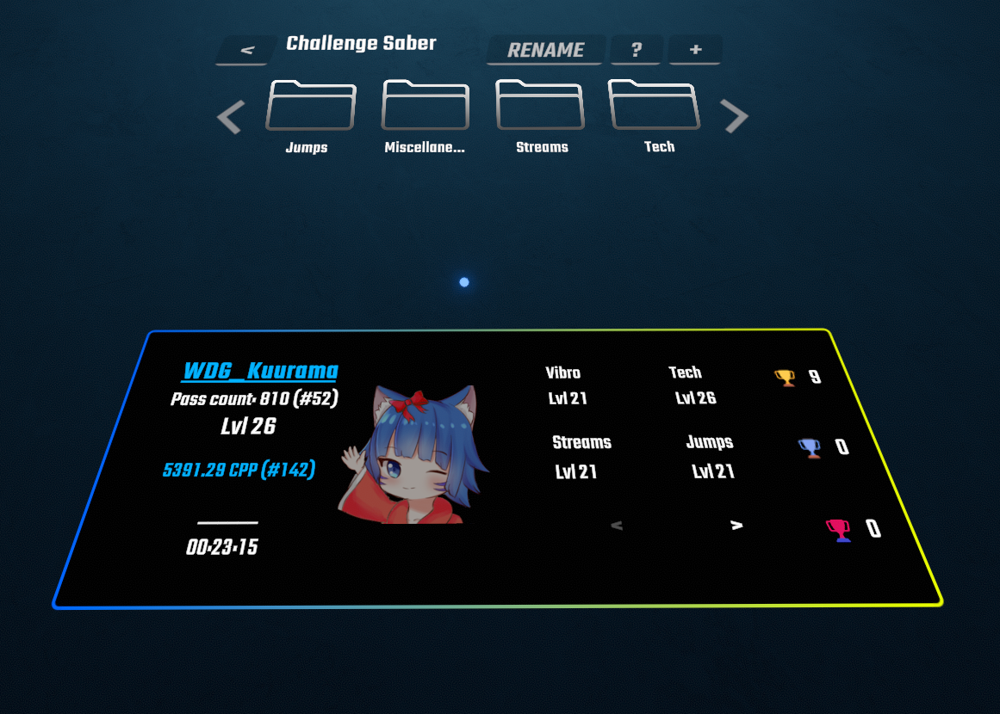

And second, the in-game player card:
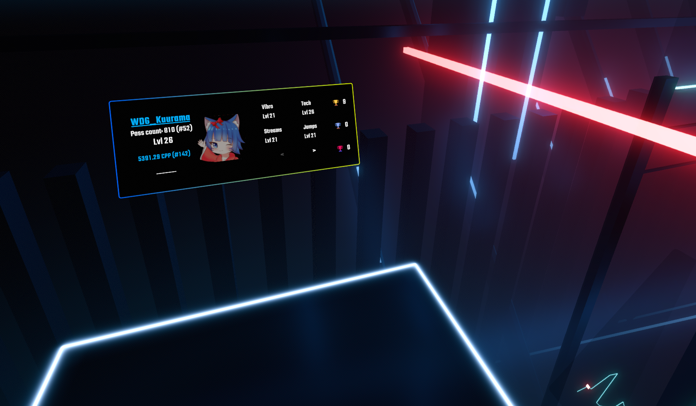

As you can see, there is a little timer at the botton left of the player card. This represents how much time you've
spent playing during this whole day. (It does persist during restarts until the day ends, and you close the game.)

There is a special feature you guys should be aware of. As you can see, the playercard have a nice looking gradient
background. This background capabilities is unlocked by **reaching level 30** on Challenge Saber.
Note that this might also be a feature available for future patreon supporters, however, I still believe players
deserves to have those cosmetic rewards accessible through time and effort too, and not just through support money.

Regarding the player card settings, accessing them is pretty easy, just **click on your avatar**:
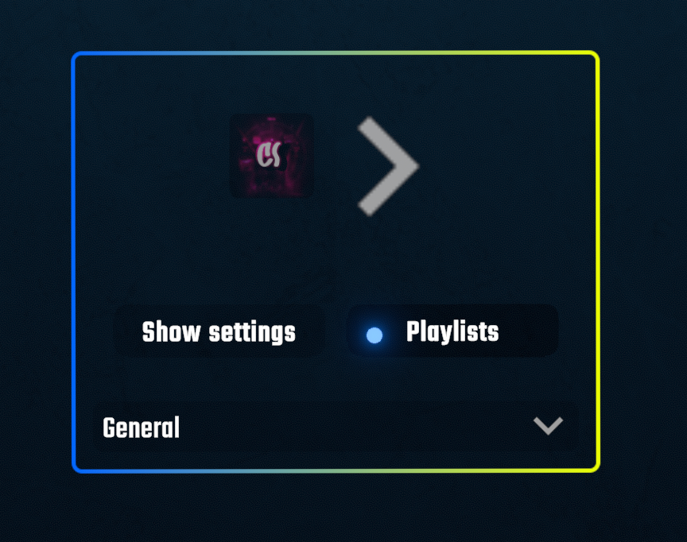

And as you can see, there is a playlist button hidding in there :eyes:

## The Playlist Downloader

Clicking that playlist button on the player card settings brings this menu up:
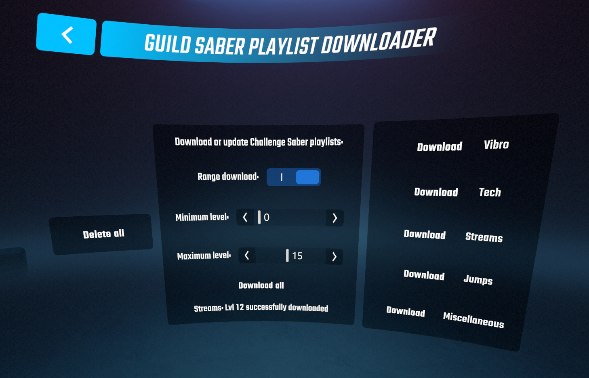

With it, you can manage your selected guild's playlists. I will let you use it and discover it by yourself.
However, a feature you must use is the **Folder view** of Playlist manager.

If you look above the player-card, at your feet, there is a menu from playlist manager, clicking the last button on the
right will open the folder view. In you head into "GuildSaber" and then the Guild of your choice, you will find all the
downloaded categories.

Using it (and selecting a category there) will reduce the amount of playlists visible in your game UI, basically
filtering them to whatever folder you selected. Which is a must, given the 180+ playlists Challenge Saber have lol.

## RankedMap Stats

Even dreamed of knowing if a map was ranked on your favorite guild without having to open discord or the website?
We've got you covered.

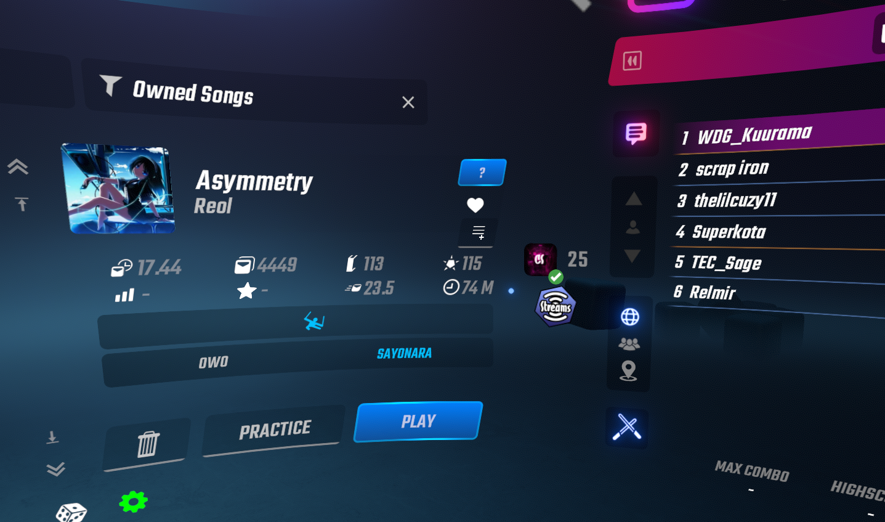

When you select a map, if it's ranked, you will see a little guild icon followed by the difficutly level and categoties
it belongs to.

It now also shows wether you got a pass on it or not with a little green checkmark ^^

# Website

The website is currently in early stage development. (It got remade from scratch at the same time as the API)
Currently, it offers the following features:

- The ability to sign in using BeatLeader, creating a new account, which is necessary to use the mod and the bot.
  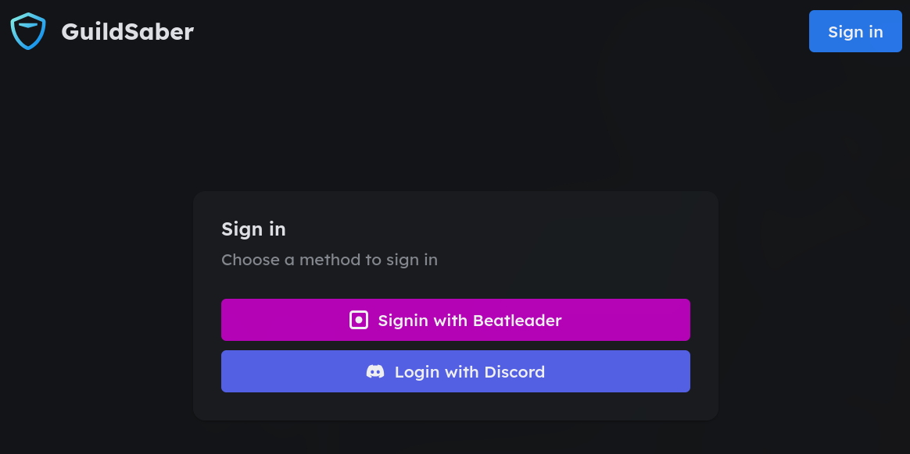

- A small dashboard where you can link your Discord account to use the bot, but also join the Challenge Saber guild.
  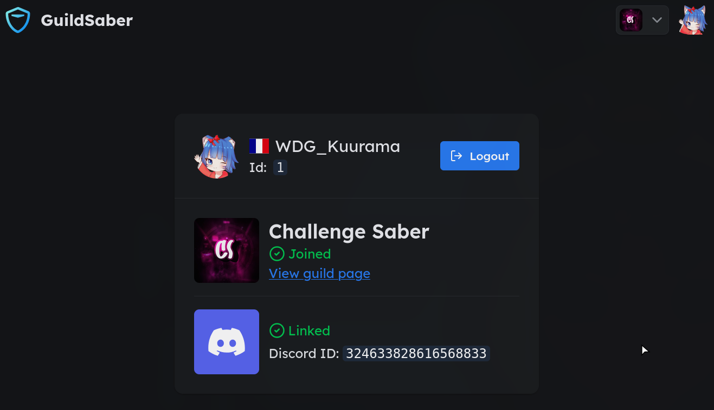

- A page to view the guilds in detail with map searching and filtering capabilities.
  (Still a WIP, but things are getting there)
  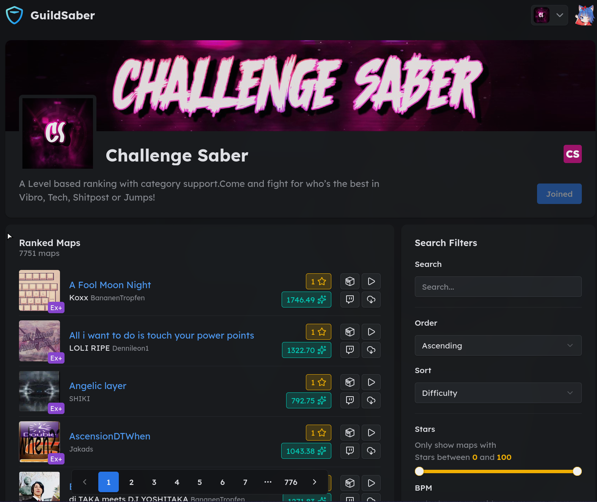

# Discord Bot

The discord bot is currently the most feature complete part of the project. It offers a wide variety of features such
as:

- A command to display your player card.
  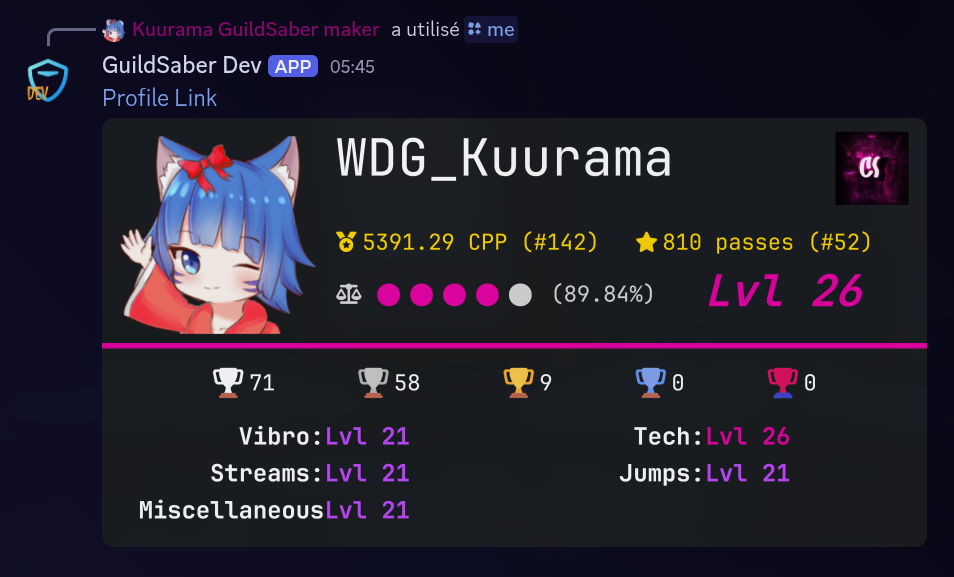

- The search guilds command, allowing you to search for guilds you might have not joined yet.
  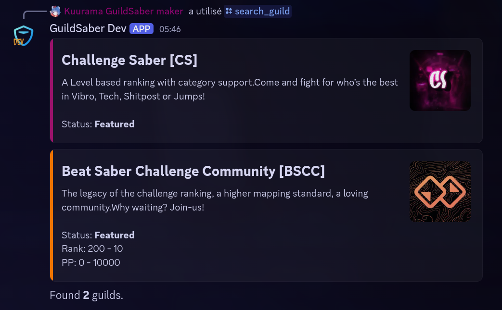

- A command that shows your progress through the map pool:
  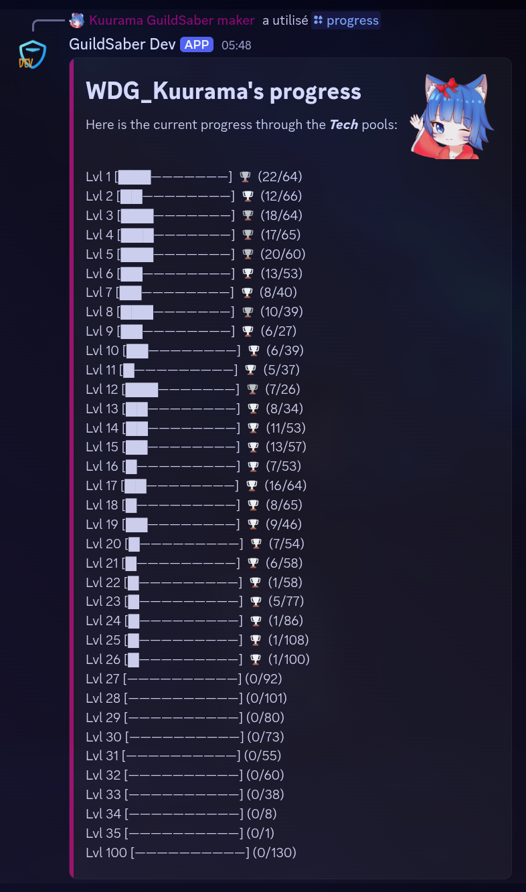

- A command to search for maps:
  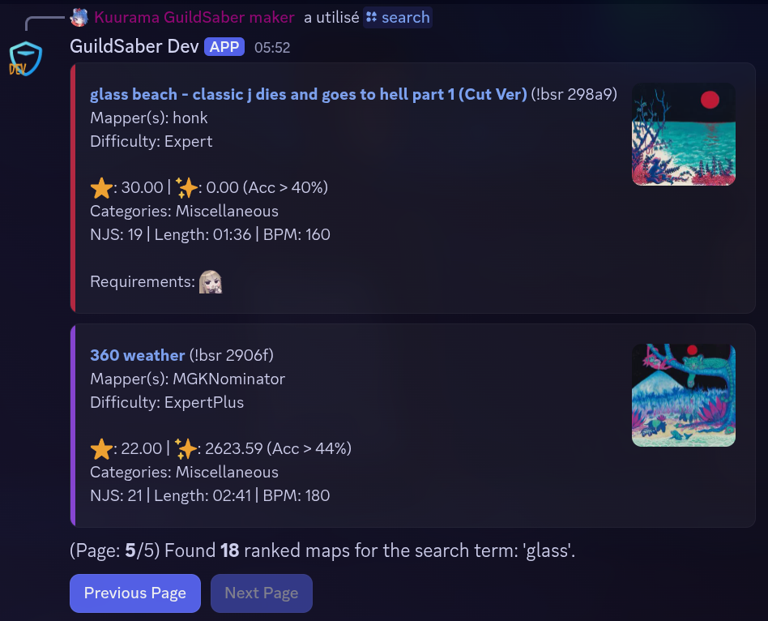

- A command to show the grind pool including your passes and fails:
  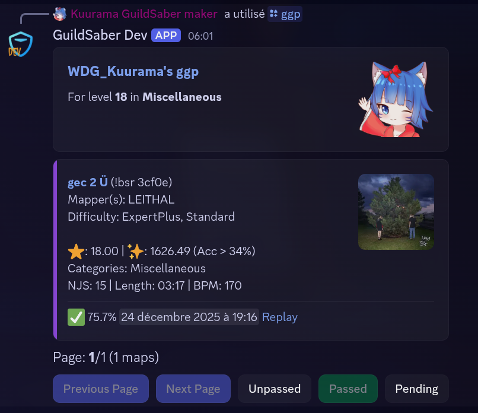

- A command to get the playlists (parametrized):
  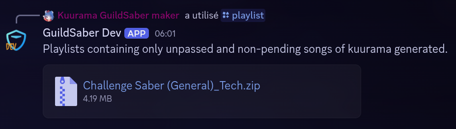

And finally, a command to flex what you've done since last time you flexed (It also displays level change and attribute
roles for them):
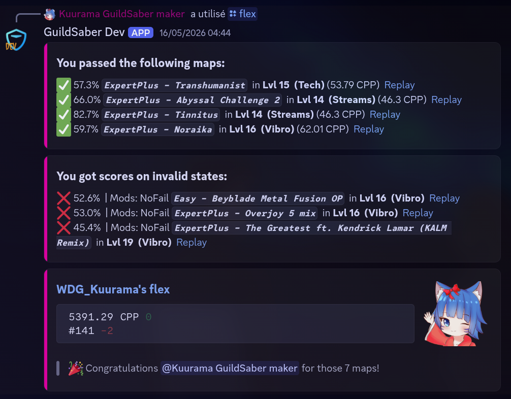

## Developer Docs

- API: `src/GuildSaber.Api/README.md`
- Website: `src/GuildSaber.Website/README.md`
- Mod: `src/GuildSaber.Mod/README.md`
- Discord Bot: `src/GuildSaber.DiscordBot/README.md`
- Database: `src/GuildSaber.Database/README.md`
- Common: `src/GuildSaber.Common/README.md`

## Contributing

Before contributing, please ensure you understand the license implications. All contributions will be subject to the
project's licensing terms.

1. Set up your development environment as described above
2. Fork the repository and create a feature branch
3. Make your changes
4. Ensure all tests pass by running:
   ```bash
   dotnet test
   ```
5. Submit a pull request

When committing, sign your commits to acknowledge the contribution terms:

```bash
git commit -s -m "Your commit message"
```